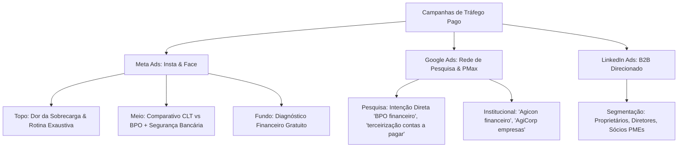

# 🚀 Planejamento & Playbook de Tráfego Pago: BPO Financeiro Grupo Agicon
*(Inspirado no Posicionamento e Metodologia da AgiCorp Seguros)*

---

## 1. Posicionamento Estratégico & DNA da Marca

### 1.1. O Paralelo: Metodologia AgiCorp aplicada ao BPO Financeiro
Assim como a **AgiCorp** se posiciona com:
> *"Uma nova empresa. A mesma confiança."*  
> *"Proteção para aquilo que você levou anos para construir."*  
> *"Seguro não deve ser comprado no escuro — consultoria técnica antes da venda."*  
> *"Traduzindo o Segurês: clareza e transparência."*

O **BPO Financeiro do Grupo Agicon** adota a mesma régua de credibilidade e rigor:
- **Origem e Solidez:** Mais de 11 anos de história da Agicon Contabilidade e Grupo Agicon com mais de 500 clientes ativos.
- **Tese Central:** *"O mercado não aceita mais amadores. Sua empresa só cresce quando você conhece seus números."*
- **Abordagem Consultiva:** Diagnóstico financeiro sem custo antes da contratação. Não vendemos pacote fechado sem entender a rotina da empresa.
- **Segurança Operacional:** O cliente mantém total controle. O BPO prepara e agenda no banco (acesso secundário de operador), mas a autorização final do pagamento é sempre exclusiva do empresário.
- **Liberdade Contratual:** Sem fidelidade obrigatória. O cliente paga pelo mês prestado, com base na confiança e no resultado entregue.
- **"Traduzindo o Financês":** Desmistificar indicadores (DRE, Ponto de Equilíbrio, Margem de Contribuição, Fluxo de Caixa Projetado) para que o empresário tome decisões sem dor de cabeça.

---

## 2. Definição do ICP (Perfil de Cliente Ideal) & Segmentação

### 2.1. Quem é o decisor?
- **Público:** Sócios, Diretores, Proprietários, Médicos/Dentistas com clínicas, Engenheiros com construtoras/escritórios, Prestadores de serviços e Pequenas indústrias/comércio.
- **Faturamento estimado:** R$ 30.000 a R$ 500.000+/mês.
- **Dores latentes:**
  1. Passa noites ou fins de semana pagando boletos, emitindo notas e conferindo extratos bancários.
  2. Sensação de "vender muito, mas não ver a cor do dinheiro".
  3. Contas pagas em atraso por puro esquecimento operacional (gerando juros e multas desnecessárias).
  4. Falta de tempo para focar em vendas, gestão e novos clientes.
  5. Alto custo e dor de cabeça para contratar um funcionário CLT para o financeiro (encargos, risco trabalhista, faltas, férias, treinamento).

---

## 3. Arquitetura de Campanhas por Plataforma

---

## 4. Estrutura de Oferta Irresistível (Front-End)

| Componente | Detalhe |
| :--- | :--- |
| **Isca / Gancho de Entrada** | **Diagnóstico Financeiro Gratuito (Sessão Estratégica)** com Carolina Carneiro (Especialista em BPO). |
| **Garantia / Diferencial** | **Sem contrato de fidelidade** (Paga mês a mês) + **100% Seguro** (sem acesso à autorização da sua conta). |
| **Ticket de Entrada Transparente** | Planos a partir de **R$ 500/mês**, escaláveis conforme a demanda da empresa. |
| **CTA Principal** | *"Agendar Diagnóstico Gratuito pelo WhatsApp"* |

---

## 5. Matriz de Conteúdo: "Traduzindo o Financês" (Estilo AgiCorp)

| Conceito Técnico | Como o Empresário Entende | O que o BPO Agicon Resolve |
| :--- | :--- | :--- |
| **Conciliação Bancária** | "Saber se o dinheiro do extrato bate exatamente com o que entrou e saiu sem sobrar nem faltar um centavo." | Feita diariamente para você nunca ter saldo fantasma. |
| **Contas a Pagar / Agendamento** | "Você não gasta mais 2 horas do seu dia digitando código de barras de fornecedor e imposto." | Nossa equipe agenda tudo; você só dá o OK final no app do banco. |
| **Contas a Receber & Cobrança** | "Parar de ter vergonha ou esquecer de cobrar quem está te devendo." | Emissão de boletos, notas e régua de cobrança automática e profissional. |
| **DRE Gerencial** | "Descobrir se a sua empresa dá lucro real ou se você está trabalhando só para pagar contas." | Relatório visual e simplificado enviado mensalmente. |
| **Fluxo de Caixa Projetado** | "Saber exatamente se vai faltar dinheiro no dia 20 antes de chegar no dia 20." | Previsibilidade para negociar com fornecedores e investir com segurança. |
