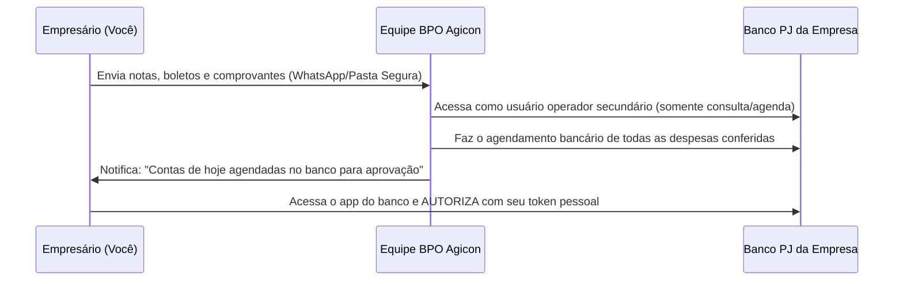

# 🌐 Estrutura & Copywriting de Landing Page de Alta Conversão
### BPO Financeiro do Grupo Agicon — Padrão AgiCorp & Agicon

---

## 1. Topo da Página (Hero Section)

### [ BARRA DE AVISO SUPERIOR ]
> 🎯 **Diagnóstico Financeiro Gratuito para Empresas:** Analisamos a rotina e o fluxo de caixa do seu negócio sem custo. **[Quero meu Diagnóstico]**

### [ CABEÇALHO / NAVBAR ]
- **Logo:** `AGICON | GRUPO EMPRESARIAL` + Badge `BPO FINANCEIRO`
- **Menu:** `Como Funciona` | `Segurança` | `Planos` | `Traduzindo o Financês` | `Sobre Nós`
- **Botão CTA:** `[ Fale no WhatsApp ]` *(Link direto com mensagem pré-preenchida)*

---

### [ SEÇÃO PRINCIPAL (HERO) ]
- **Tag Superior:** `⚡ TERCEIRIZAÇÃO FINANCEIRA INTELIGENTE`
- **Headline (H1):**  
  # Pare de perder tempo com boletos e extratos.  
  # Tenha o setor financeiro da sua empresa organizado e 100% sob controle.
- **Subheadline:**  
  *O BPO Financeiro do Grupo Agicon assume suas contas a pagar, contas a receber, conciliação e relatórios gerenciais para você focar no que realmente importa: vender e crescer.*
- **Bullets de Confiança Rápida:**  
  ✔ **Sem contrato de fidelidade** (você paga pelo mês prestado)  
  ✔ **100% Seguro:** você nunca entrega senhas de autorização da sua conta  
  ✔ **Planos sob medida** a partir de R$ 500/mês  
  ✔ **Mais de 11 anos de solidez** do Grupo Agicon (+500 empresas atendidas)
- **Ações:**  
  - Botão Primário: `[ Solicitar Diagnóstico Financeiro Sem Custo ]`
  - Botão Secundário: `[ Ver Como Funciona o BPO ]`
- **Elemento Visual ao Lado:**  
  Mockup elegante de dashboard financeiro (DRE gerencial limpo, conciliação do dia com check verde, gráficos de fluxo de caixa) + foto da especialista Carolina Carneiro em ambiente executivo.

---

## 2. Faixa de Credibilidade & Segurança

| Ícone | Destaque | Detalhe |
| :---: | :--- | :--- |
| 🛡️ | **Acesso Protegido** | Perfil de operador secundário no banco: você sempre aprova |
| ⚡ | **Sem Amadorismo** | Processos diários rigorosos e entregas pontuais |
| 📊 | **Números Claros** | Relatórios descomplicados sem enrolação técnica |
| 🤝 | **Sem Fidelidade** | Parceria baseada na entrega de valor e confiança mútua |

---

## 3. O Problema vs. A Solução

### 🔴 O Cenário Atual (A Dor do Dono):
- Você chega cansado no fim do dia e ainda precisa conferir notas e pagar boletos.
- Paga juros e multas bobas por puro esquecimento operacional.
- Tem vergonha ou falta de tempo para cobrar clientes inadimplentes.
- Não sabe com precisão qual é o lucro real no final do mês.
- Contratar um funcionário interno custa caro, exige treinamento e traz riscos trabalhistas.

### 🟢 Com o BPO Financeiro do Grupo Agicon:
- **Rotina Leve:** Nossa equipe faz a gestão diária de contas a pagar e receber.
- **Pontualidade:** Boletos e tributos agendados com antecedência rigorosa.
- **Cobrança Ativa:** Cobrança profissional e respeitosa de inadimplentes.
- **Previsibilidade:** Fluxo de caixa projetado e DRE para você decidir com clareza.
- **Economia Brutal:** Tenha uma equipe especializada por uma fração do custo de uma contratação CLT.

---

## 4. Como Funciona a Segurança Bancária (Quebra de Objeção Fundamental)

> ### *"A Agicon vai ter acesso ao meu dinheiro?"*  
> **A resposta é NÃO.** Veja a dinâmica de segurança operacional:

**Em nenhum momento você compartilha senhas de movimentação financeira.** O poder de autorizar saídas da conta permanece 100% com você.

---

## 5. Traduzindo o Financês: Indicadores que Transformam seu Negócio

*(Inspirado na seção de sucesso da AgiCorp "Traduzindo o Segurês")*

1. **Conciliação Bancária:**  
   Não é só olhar o saldo; é garantir que cada centavo bate com as notas e comprovantes, sem perdas misteriosas.
2. **Ponto de Equilíbrio:**  
   O valor exato que sua empresa precisa faturar todo mês apenas para pagar os custos fixos antes de começar a lucrar.
3. **Margem de Contribuição:**  
   Qual produto ou serviço realmente coloca dinheiro no seu bolso e qual está gerando prejuízo disfarçado.
4. **Fluxo de Caixa Projetado:**  
   Prever as contas dos próximos 30 dias para nunca ser pego de surpresa no dia do pagamento.

---

## 6. Planos Transparentes & Dimensionados

| Plano | Ideal Para | Escopo de Serviços | Investimento |
| :--- | :--- | :--- | :--- |
| **Plano A** | Pequenos negócios iniciando a organização | Até 10 NFs/mês, até 10 cobranças, conciliação de 1 conta PJ, contas a pagar e receber, controle de inadimplentes | **A partir de R$ 500/mês** |
| **Plano B** | Negócios com volume regular de cobranças | Até 25 cobranças, conciliação de 2 contas PJ, gestão de pagamentos, cobrança de inadimplentes, relatório de fluxo de caixa | **A partir de R$ 800/mês** |
| **Plano C** | Empresas em expansão operacional | Até 25 NFs/mês, até 25 cobranças, conciliação de 2 contas PJ, **agendamento bancário de até 25 pagamentos**, relatórios e fluxo de caixa | **A partir de R$ 1.200/mês** |
| **Plano D** | Operações consolidadas com alto volume | Até 30 cobranças/mês, conciliação de 2 contas PJ, **agendamento bancário de até 30 pagamentos**, indicadores e DRE gerencial completo | **A partir de R$ 1.600/mês** |
| **Sob Medida** | Médias empresas e demandas personalizadas | Volume customizado de transações, múltiplos bancos, reuniões estratégicas periódicas | **Sob Consulta** |

*Nota: Upgrade disponível a qualquer momento conforme o crescimento da sua empresa.*

---

## 7. Sobre o Grupo Agicon & Liderança Técnica

- **Mais de 11 anos de história:** Atuando como referência contábil e empresarial em Sengés-PR e para clientes em todo o Brasil.
- **Ecossistema Completo:** Agicon Contabilidade + AgiCorp Seguros + BPO Financeiro.
- **Liderança Especializada:** Setor conduzido por **Carolina Carneiro**, especialista em BPO Financeiro com ampla experiência em análise, governança e rotinas corporativas.

---

## 8. Perguntas Frequentes (FAQ)

### O que é BPO Financeiro?
BPO é a sigla para *Business Process Outsourcing* (Terceirização de Processos de Negócio). Significa confiar a especialistas as tarefas operacionais das finanças da sua empresa.

### Preciso trocar de banco ou de sistema?
Não. Nós nos adaptamos à sua rotina, trabalhando com os bancos PJ que você já utiliza e com os principais softwares de gestão do mercado ou planilhas integradas.

### Como funciona o contrato?
Trabalhamos com modelo sem fidelidade obrigatória. Você contrata e renova mês a mês de acordo com a qualidade do serviço entregue.

### Como começamos?
Em 3 passos simples: preenchimento de alinhamento inicial, criação de acesso secundário de consulta no banco e validação dos processos.

---

## 9. Rodapé & Canais de Atendimento

- **Telefone/WhatsApp BPO:** (15) 9.9768-7104  
- **Central Agicon:** (43) 9.9616-0143  
- **E-mail:** bpofinanceiro@agicon.srv.br  
- **Endereço:** Rua José Domingos Branco, 27 - Centro, Sengés/PR  
- **CNPJ:** 07.144.565/0001-91
